p8105\_hw6\_jh4054
================
Joy Hsu
11/24/2018

### Problem 1

The homicide dataset was collated by Washington Post on homicide cases in 50 major US cities, from 2007 to 2015. We will investigate the odds ratio of solving a homicide for white victims versus non-white victims.

To begin, we tidy the dataset as follows:

-   create city\_state variable
-   omit observations from "Dallas, TX", "Phoenix, AZ", "Kansas City, MO" since these locations do not report victim race.
-   omit single "Tulsa, AL" observation due to erroneous entry.
-   modify victim age to numeric variable
-   modify victim\_race to two factor variable: white (reference) and non\_white
-   modify victim\_sex to factor variable: Male, Female, Unknown
-   create a binary variable indicating whether homicide case is resolved: 0 = unsolved case, 1 = resolved case ("disposition = Closed by arrest")

``` r
#load and tidy dataset
homicide_data = read_csv("./data/homicide-data.csv") %>% 
  janitor::clean_names() %>% 
  mutate(
    city_state = str_c(city, ", ", state),
    victim_age = as.numeric(as.factor(victim_age)),
    victim_race = ifelse(victim_race == "White", "white", "non_white"),
    victim_race = fct_relevel(victim_race, c("white", "non_white")),
    victim_sex = as.factor(victim_sex),
    hom_unsolved = as.factor(ifelse(disposition != "Closed by arrest", 0, 1))) %>% 
  filter(!(city_state %in% c("Tulsa, AL", "Dallas, TX", "Phoenix, AZ", "Kansas City, MO")))
```

### Problem 1.1 - Baltimore, MD

For the city of Baltimore, MD, we fit a logistic regression with resolved versus unsolved homicide as the outcome and victim age, sex, and race (white vs. non-white) as predictors. The odds of resolving a homicide case for a non-white victim is 0.452 (Odds Ratio 95% CI: 0.321, 0.636) times the odds of solving a homicide case for a white homicide victim, in Baltimore, keeping all other variables constant.

``` r
# filter dataframe for baltimore victims only
baltimore_df = homicide_data %>% 
   filter(city_state == "Baltimore, MD") 

# save glm for baltimore unsolved homicides as object
glm_baltimore = baltimore_df %>%
  glm(hom_unsolved ~ victim_age + victim_race + victim_sex, family = binomial(), data = .)

# table for adjusted odds ratio, 95% Confidence Interval, p-value 
glm_baltimore %>% broom::tidy(conf.int = TRUE, exponentiate = TRUE) %>% 
  select(term, estimate, conf.low, conf.high, p.value) %>% 
  rename(
    "Odds_Ratio" = estimate, 
    "95% CI lower" = conf.low, 
    "95% CI upper" = conf.high) %>% 
  filter(term == "victim_racenon_white") %>% 
  knitr::kable(digits = 3)
```

| term                   |  Odds\_Ratio|  95% CI lower|  95% CI upper|  p.value|
|:-----------------------|------------:|-------------:|-------------:|--------:|
| victim\_racenon\_white |        0.453|         0.321|         0.636|        0|

### Problem 1.2 - All Cities

``` r
# Odds Ratio for victim_racenon_white in 47 cities
logfit_cities = homicide_data %>% 
  select(city_state, hom_unsolved, victim_age, victim_race, victim_sex) %>% 
  group_by(city_state) %>% 
  nest() %>% 
  mutate(
    logfit = map(data, ~glm(hom_unsolved ~ victim_age + victim_race + victim_sex, family = binomial(), data = .)),
    logfit = map(logfit, ~broom::tidy(., conf.int = TRUE, exponentiate = TRUE))) %>% 
  select(city_state, logfit) %>% 
  unnest() %>% 
  filter(term == "victim_racenon_white") %>% 
  select(city_state, estimate, conf.low, conf.high, p.value) %>% 
  rename(
    "OR" = estimate, 
    "CI_lower" = conf.low, 
    "CI_upper" = conf.high) %>% 
  mutate(city_state = fct_reorder(city_state, OR))

# OR and 95% CI for each city
logfit_cities %>% 
  arrange(OR) %>% 
  head(10) %>% 
  knitr::kable(digits = 3)
```

| city\_state    |     OR|  CI\_lower|  CI\_upper|  p.value|
|:---------------|------:|----------:|----------:|--------:|
| Boston, MA     |  0.121|      0.045|      0.272|    0.000|
| Omaha, NE      |  0.180|      0.096|      0.317|    0.000|
| Oakland, CA    |  0.217|      0.101|      0.427|    0.000|
| Pittsburgh, PA |  0.290|      0.162|      0.498|    0.000|
| Cincinnati, OH |  0.327|      0.186|      0.554|    0.000|
| Stockton, CA   |  0.395|      0.205|      0.747|    0.005|
| Louisville, KY |  0.434|      0.286|      0.650|    0.000|
| San Diego, CA  |  0.434|      0.264|      0.699|    0.001|
| Buffalo, NY    |  0.447|      0.243|      0.811|    0.009|
| Baltimore, MD  |  0.453|      0.321|      0.636|    0.000|

The Odds Ratio and 95% Confidence Interval for solving a homicide case for a non-white victim versus a white victim is reported for lowest 10 of 47 major US cities.

``` r
# Odds Ratio plot for all cities
logfit_cities %>% 
  ggplot(aes(x = city_state, y = OR, color = city_state)) +
  geom_point() +
  geom_errorbar(mapping = aes(x = city_state, ymin = CI_lower, ymax = CI_upper)) + 
  labs(
    title = "Odds Ratio of Solving Homicide Case, Race non-white vs. white",
    x = "City",
    y = "Odds Ratio",
    caption = "*Case Data collated by Washington Post") + 
  viridis::scale_color_viridis(
    name = "City, State", 
    discrete = TRUE) +
  theme_bw() +
  theme(axis.text.x = element_text(angle = 90, hjust = 1), 
        legend.position = "none")
```

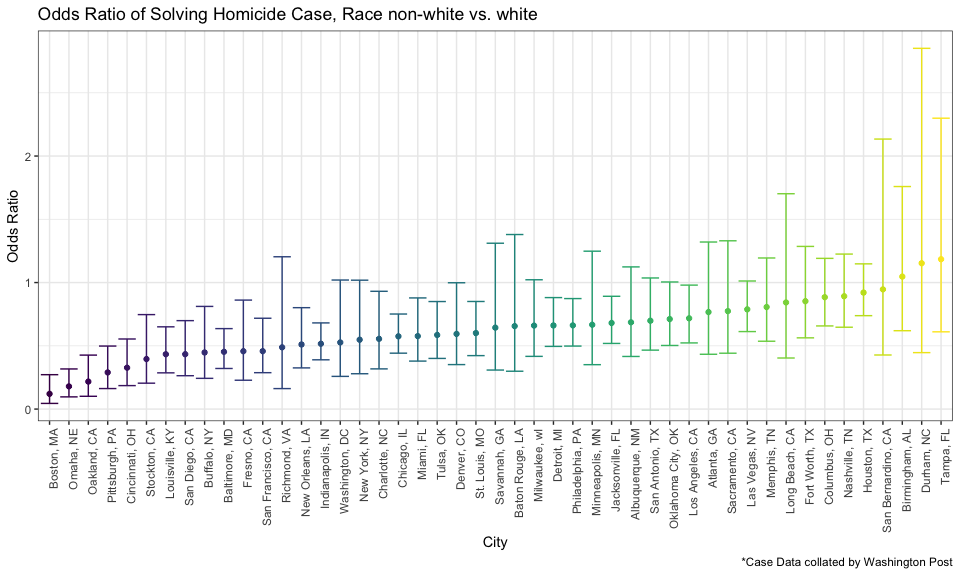

44 out of the 47 major cities had an odds ratio under 1, comparing the odds of resolving homicide case for non-white victim versus white victim. In other words, the likelihood of resolving a homicide event for a non-white victim is consistently less than the likelihood of resolving a homicide event of a white victim, across most major US cities.

In only three cities (Durham, NC; Birmingham, AL; Tampa, FL), the odds ratio was greater than 1. However, the CI lower limit for the odds ratio is less than 1 in these locations.

### Problem 2.1 - Propose Model

In this section, we will investigate the birthweight dataset and propose a regression model for birthweight.

First, we will explore the distribution of the main response. Next, we will select 2 model candidates from 1) stepwise backwards elimination and 2) optimization of the adjusted R<sub>2</sub> criteria. Candidates will be assessed for linear regression model assumptions, including normality of the residuals and homoscedasticity of residuals. Lastly, candidates will be compared for parsimony and assessed for multicollinearity.

Data Cleaning Steps:

-   exclude following two variables with values "0" for all observations.
    -   pnumlbw: previous number of low birth weight babies
    -   pnumgsa: number of prior small for gestational age babies
-   convert baby sex, father race, mother race, and malformations to factor variables

``` r
# load birthweight dataset
bw = read_csv("./data/birthweight.csv")

# tidy dataset
bw = bw %>% 
  mutate(
    babysex = as.factor(recode(babysex, "1" = "male", "2" = "female")),
    frace = factor(frace, levels = c(1, 2, 3, 4, 8), labels = c("white", "black", "asian", "puerto_rican", "other")),
    mrace = factor(mrace, levels = c(1, 2, 3, 4), labels = c("white", "black", "asian", "puerto_rican")),
    malform = factor(malform, levels = c(0, 1), labels = c("absent", "present"))) %>% 
  select(-pnumlbw, -pnumsga)
```

#### **Birthweight Histogram**

Distribution of the main response birthweight approximates a normal distribution.

``` r
bw %>% 
  ggplot(aes(x = bwt)) +
  geom_histogram()
```

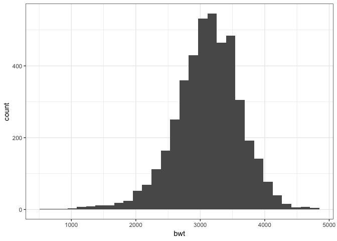

#### **Stepwise Backward Elimation**

Using an automatic search function that minimizes AIC using stepwise backward elimination, we obtain 11-predictor Candidate Model 1:

-   AIC score: 48705.38
-   bwt ~ babysex + bhead + blength + delwt + fincome + gaweeks + mheight + mrace + parity + ppwt + smoken

``` r
# Specify full and null models for forward & backward selection based on AIC Criteria
null = lm(bwt ~ 1, data = bw)
null
## 
## Call:
## lm(formula = bwt ~ 1, data = bw)
## 
## Coefficients:
## (Intercept)  
##        3114

full = lm(bwt ~ ., data = bw)
full
## 
## Call:
## lm(formula = bwt ~ ., data = bw)
## 
## Coefficients:
##       (Intercept)        babysexmale              bhead  
##        -6236.6841           -28.7073           130.7781  
##           blength              delwt            fincome  
##           74.9536             4.1007             0.2898  
##        fraceblack         fraceasian  fracepuerto_rican  
##           14.3313            21.2361           -46.9962  
##        fraceother            gaweeks     malformpresent  
##            4.2969            11.5494             9.7650  
##          menarche            mheight             momage  
##           -3.5508             9.7874             0.7593  
##        mraceblack         mraceasian  mracepuerto_rican  
##         -151.4354           -91.3866           -56.4787  
##            parity              ppbmi               ppwt  
##           95.5411             4.3538            -3.4716  
##            smoken             wtgain  
##           -4.8544                 NA

# perform stepwise backward selection
step(full, data = bw, direction="backward")
## Start:  AIC=48717.83
## bwt ~ babysex + bhead + blength + delwt + fincome + frace + gaweeks + 
##     malform + menarche + mheight + momage + mrace + parity + 
##     ppbmi + ppwt + smoken + wtgain
## 
## 
## Step:  AIC=48717.83
## bwt ~ babysex + bhead + blength + delwt + fincome + frace + gaweeks + 
##     malform + menarche + mheight + momage + mrace + parity + 
##     ppbmi + ppwt + smoken
## 
##            Df Sum of Sq       RSS   AIC
## - frace     4    124365 320848704 48712
## - malform   1      1419 320725757 48716
## - ppbmi     1      6346 320730684 48716
## - momage    1     28661 320752999 48716
## - mheight   1     66886 320791224 48717
## - menarche  1    111679 320836018 48717
## - ppwt      1    131132 320855470 48718
## <none>                  320724338 48718
## - fincome   1    193454 320917792 48718
## - parity    1    413584 321137922 48721
## - mrace     3    868321 321592659 48724
## - babysex   1    853796 321578134 48727
## - gaweeks   1   4611823 325336161 48778
## - smoken    1   5076393 325800732 48784
## - delwt     1   8008891 328733230 48823
## - blength   1 102050296 422774634 49915
## - bhead     1 106535716 427260054 49961
## 
## Step:  AIC=48711.51
## bwt ~ babysex + bhead + blength + delwt + fincome + gaweeks + 
##     malform + menarche + mheight + momage + mrace + parity + 
##     ppbmi + ppwt + smoken
## 
##            Df Sum of Sq       RSS   AIC
## - malform   1      1447 320850151 48710
## - ppbmi     1      6975 320855679 48710
## - momage    1     28379 320877083 48710
## - mheight   1     69502 320918206 48710
## - menarche  1    115708 320964411 48711
## - ppwt      1    133961 320982665 48711
## <none>                  320848704 48712
## - fincome   1    194405 321043108 48712
## - parity    1    414687 321263390 48715
## - babysex   1    852133 321700837 48721
## - gaweeks   1   4625208 325473911 48772
## - smoken    1   5036389 325885093 48777
## - delwt     1   8013099 328861802 48817
## - mrace     3  13540415 334389119 48885
## - blength   1 101995688 422844392 49908
## - bhead     1 106662962 427511666 49956
## 
## Step:  AIC=48709.53
## bwt ~ babysex + bhead + blength + delwt + fincome + gaweeks + 
##     menarche + mheight + momage + mrace + parity + ppbmi + ppwt + 
##     smoken
## 
##            Df Sum of Sq       RSS   AIC
## - ppbmi     1      6928 320857079 48708
## - momage    1     28660 320878811 48708
## - mheight   1     69320 320919470 48708
## - menarche  1    116027 320966177 48709
## - ppwt      1    133894 320984044 48709
## <none>                  320850151 48710
## - fincome   1    193784 321043934 48710
## - parity    1    414482 321264633 48713
## - babysex   1    851279 321701430 48719
## - gaweeks   1   4624003 325474154 48770
## - smoken    1   5035195 325885346 48775
## - delwt     1   8029079 328879230 48815
## - mrace     3  13553320 334403471 48883
## - blength   1 102009225 422859375 49906
## - bhead     1 106675331 427525481 49954
## 
## Step:  AIC=48707.63
## bwt ~ babysex + bhead + blength + delwt + fincome + gaweeks + 
##     menarche + mheight + momage + mrace + parity + ppwt + smoken
## 
##            Df Sum of Sq       RSS   AIC
## - momage    1     29211 320886290 48706
## - menarche  1    117635 320974714 48707
## <none>                  320857079 48708
## - fincome   1    195199 321052278 48708
## - parity    1    412984 321270064 48711
## - babysex   1    850020 321707099 48717
## - mheight   1   1078673 321935752 48720
## - ppwt      1   2934023 323791103 48745
## - gaweeks   1   4621504 325478583 48768
## - smoken    1   5039368 325896447 48773
## - delwt     1   8024939 328882018 48813
## - mrace     3  13551444 334408523 48881
## - blength   1 102018559 422875638 49904
## - bhead     1 106821342 427678421 49953
## 
## Step:  AIC=48706.02
## bwt ~ babysex + bhead + blength + delwt + fincome + gaweeks + 
##     menarche + mheight + mrace + parity + ppwt + smoken
## 
##            Df Sum of Sq       RSS   AIC
## - menarche  1    100121 320986412 48705
## <none>                  320886290 48706
## - fincome   1    240800 321127090 48707
## - parity    1    431433 321317724 48710
## - babysex   1    841278 321727568 48715
## - mheight   1   1076739 321963029 48719
## - ppwt      1   2913653 323799943 48743
## - gaweeks   1   4676469 325562760 48767
## - smoken    1   5045104 325931394 48772
## - delwt     1   8000672 328886962 48811
## - mrace     3  14667730 335554021 48894
## - blength   1 101990556 422876847 49902
## - bhead     1 106864308 427750598 49952
## 
## Step:  AIC=48705.38
## bwt ~ babysex + bhead + blength + delwt + fincome + gaweeks + 
##     mheight + mrace + parity + ppwt + smoken
## 
##           Df Sum of Sq       RSS   AIC
## <none>                 320986412 48705
## - fincome  1    245637 321232048 48707
## - parity   1    422770 321409181 48709
## - babysex  1    846134 321832545 48715
## - mheight  1   1012240 321998651 48717
## - ppwt     1   2907049 323893461 48743
## - gaweeks  1   4662501 325648912 48766
## - smoken   1   5073849 326060260 48771
## - delwt    1   8137459 329123871 48812
## - mrace    3  14683609 335670021 48894
## - blength  1 102191779 423178191 49903
## - bhead    1 106779754 427766166 49950
## 
## Call:
## lm(formula = bwt ~ babysex + bhead + blength + delwt + fincome + 
##     gaweeks + mheight + mrace + parity + ppwt + smoken, data = bw)
## 
## Coefficients:
##       (Intercept)        babysexmale              bhead  
##         -6070.264            -28.558            130.777  
##           blength              delwt            fincome  
##            74.947              4.107              0.318  
##           gaweeks            mheight         mraceblack  
##            11.592              6.594           -138.792  
##        mraceasian  mracepuerto_rican             parity  
##           -74.887           -100.678             96.305  
##              ppwt             smoken  
##            -2.676             -4.843
```

#### **regsubsets() - regression subset selection**

The all possible regressions approach considers all possible subsets of the pool of explanatory variables and finds the model that best fits the data according to some criterion, such as R<sub>2</sub>(adj) and BIC.

-   The model containing explanatory variables "bhead, blength, delwt, frace:puerto\_rican, gaweeks, mraceblack, ppbmi, and smoken" optimizes the **adjusted R<sub>2</sub> criteria** and **BIC criteria**.
-   The top 5 models in the R<sub>2</sub>(adj) plot have roughly the same R<sub>2</sub>(adj). Since there is only a marginal improvement in R<sub>2</sub>(adj) by including frace:puerto\_rican, we will exclude father race (frace) entirely from the candidate model.
-   Since we must include all factor levels within a variable, we will retain all factors for mother race (mrace).

From this exploration, we obtain 7-predictor Candidate Model 2:

bwt ~ bhead + blength + delwt + gaweeks + mrace + ppbmi + smoken

``` r
leaps = leaps::regsubsets(bwt ~ ., data = bw)
# View the ranked models according to the adjusted r-squared criteria and BIC, respectively
# black indicates that a variable is included in the model, white not included. 
plot(leaps, scale = "adjr2")
```

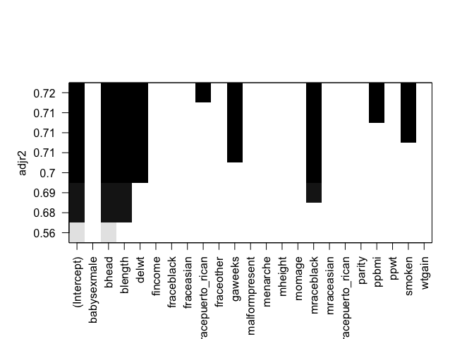

``` r
plot(leaps, scale = "bic")
```

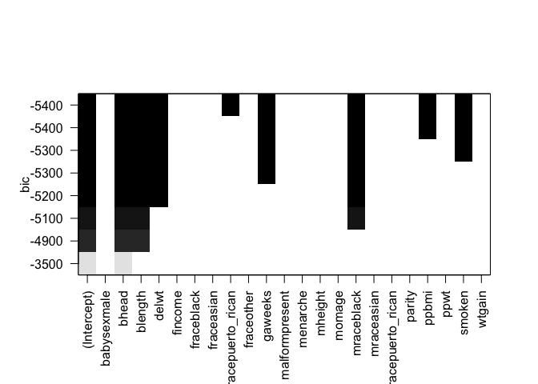

``` r

fit2 = lm(bwt ~ bhead + blength + delwt + gaweeks + mrace + ppbmi + smoken, data = bw)
summary(fit2)
## 
## Call:
## lm(formula = bwt ~ bhead + blength + delwt + gaweeks + mrace + 
##     ppbmi + smoken, data = bw)
## 
## Residuals:
##      Min       1Q   Median       3Q      Max 
## -1121.74  -179.62    -3.01   172.58  2314.76 
## 
## Coefficients:
##                     Estimate Std. Error t value Pr(>|t|)    
## (Intercept)       -5598.8294    99.5597 -56.236  < 2e-16 ***
## bhead               129.6223     3.4085  38.030  < 2e-16 ***
## blength              74.5772     2.0210  36.901  < 2e-16 ***
## delwt                 3.6505     0.2846  12.826  < 2e-16 ***
## gaweeks              12.0251     1.4507   8.289  < 2e-16 ***
## mraceblack         -144.9746     9.2209 -15.722  < 2e-16 ***
## mraceasian          -80.7445    42.3494  -1.907   0.0566 .  
## mracepuerto_rican  -100.3123    18.8795  -5.313 1.13e-07 ***
## ppbmi               -12.6864     1.9191  -6.610 4.30e-11 ***
## smoken               -4.9783     0.5861  -8.495  < 2e-16 ***
## ---
## Signif. codes:  0 '***' 0.001 '**' 0.01 '*' 0.05 '.' 0.1 ' ' 1
## 
## Residual standard error: 273 on 4332 degrees of freedom
## Multiple R-squared:  0.7165, Adjusted R-squared:  0.7159 
## F-statistic:  1217 on 9 and 4332 DF,  p-value: < 2.2e-16
```

#### Check Model Diagnostics for Candidate Models

1.  Candidate Model 1: bwt ~ bhead + blength + mrace + delwt + gaweeks + smoken + ppbmi + babysex + parity + ppwt + fincome

2.  Candidate Model 2: bwt ~ bhead + blength + delwt + gaweeks + mrace + ppbmi + smoken

For both candidate models, we add residuals and predictions to the birthweight data using the modelr package.

``` r
# Candidate 1: Stepwise Backward Elimination Model, 11 predictors
fit_step = lm(bwt ~ bhead + blength + mrace + delwt + gaweeks + smoken + ppbmi + babysex + parity + ppwt + fincome, data = bw)

# add predictions and residuals to stepwise model
bw_fit_step = modelr::add_predictions(bw, fit_step, var = "pred_step")
bw_fit_step = modelr::add_residuals(bw_fit_step, fit_step, var = "resid_step")

# Candidate 2: adjusted R-square Model, 7 predictors
fit_rs = lm(bwt ~ bhead + blength + delwt + gaweeks + mrace + ppbmi + smoken, data = bw)

# add predictions and residuals to adjusted r-square model
bw_fit_rs = modelr::add_predictions(bw, fit_rs, var = "pred_rs")
bw_fit_rs = modelr::add_residuals(bw_fit_rs, fit_rs, var = "resid_rs")
```

**1. Normality of Residuals (error distribution)**

-   Assess for nearly normal residuals with mean 0
-   Check using histogram of residuals and normal probability plot

Both candidate models have acceptable normality per Q-Q Plot and Histogram of Residuals

**1a) Candidate 1: QQ-Plot & Histogram**

``` r
# evaluate normality of residuals with qq plot
qqnorm(fit_step$residuals)
qqline(fit_step$residuals)
```

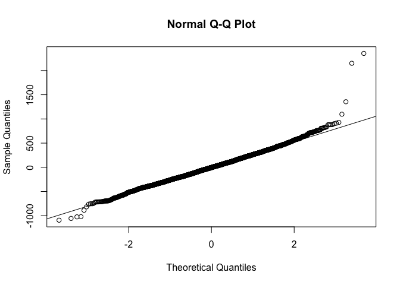

``` r

# evaluate normality of residuals with histogram
hist(fit_step$residuals)
```

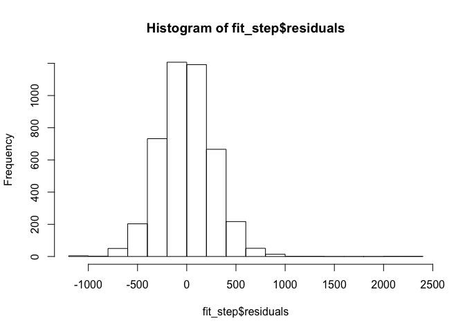

**1b) Candidate 2: QQ-Plot & Histogram**

``` r
# evaluate normality of residuals with qq plot
qqnorm(fit_rs$residuals)
qqline(fit_rs$residuals)
```


``` r

# evaluate normality of residuals with histogram
hist(fit_rs$residuals)
```

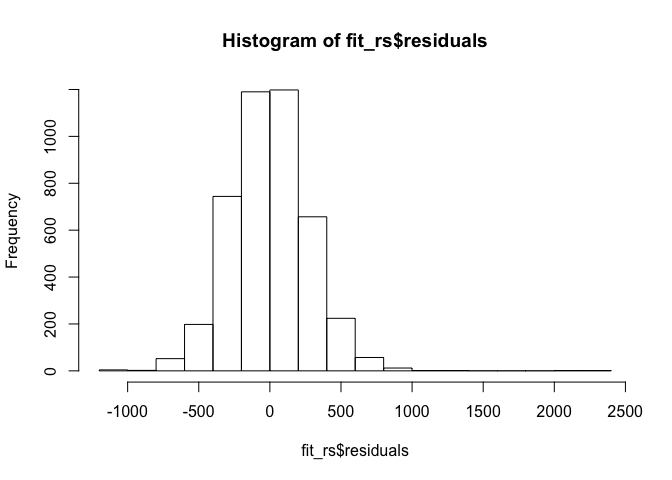

**2. Homoscedasticity: Constant variance of residuals (errors)**

-   Assess for constant variability of residuals
-   Check using residuals plots of residuals vs. predicted value (e vs. y\_hat)
    -   Residuals should be equally variable for low and high values of the predicted response variable
    -   Residuals randomly scattered in a band with a constant width around 0 (no fan-shaped)

Both candidate models have acceptable homoscedasticity for birthweight values between 1500 to 4500 grams. Residuals for model predictions below ~1500grams are skewed above 0. The model may need to be finetuned for lower birthweight predictions.

``` r
# Candidate 1: predicted value vs. residuals plot
bw_fit_step %>% 
  ggplot(aes(x = pred_step, y = resid_step)) +
  geom_point(alpha = 0.3) +
  labs(title = "Candidate Model 1")
```

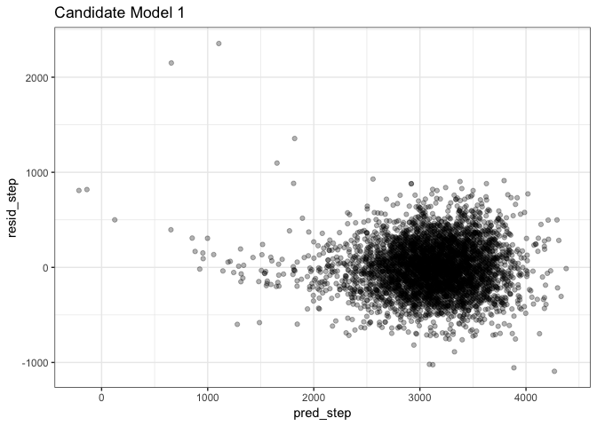

``` r

# Candidate 2: predicted value vs. residuals plot
bw_fit_rs %>% 
  ggplot(aes(x = pred_rs, y = resid_rs)) +
  geom_point(alpha = 0.3) +
  labs(title = "Candidate Model 2")
```

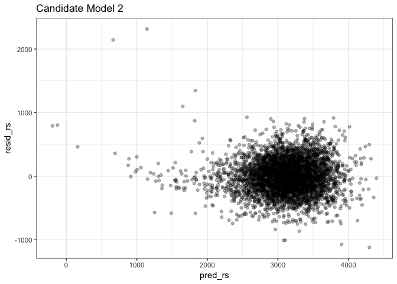

#### Optimize Parsimony and Assess Multicollinearity

Both the Candidate Model 1 and Model 2 satisfied assumptions for 1) normality of residuals and 2) constant variance of residuals (between birthweights 1500-4500gram)

Optimizing for parsimony, we will select the 7-predictor Model 2 over the 11-predictor Model 1.

Lastly, we will check for multicollinearity in the 7 predictor model using a 1) correlation table and 2) VIF (variance inflation factor) Scores, which measure how much of the variance of a regression coefficient is inflated due to multicollinearity within the model.

We will drop variable pre-pregnancy BMI due to the high correlation coefficient (0.72) with variable delivery weight.

``` r
# correlation table
bw_fit_rs %>% 
  select(bwt, bhead, blength, delwt, gaweeks, ppbmi, smoken) %>% 
  cor() %>% 
  knitr::kable()
```

|         |         bwt|       bhead|     blength|      delwt|    gaweeks|      ppbmi|      smoken|
|---------|-----------:|-----------:|-----------:|----------:|----------:|----------:|-----------:|
| bwt     |   1.0000000|   0.7471068|   0.7434508|  0.2878893|  0.4121833|  0.0939457|  -0.0756278|
| bhead   |   0.7471068|   1.0000000|   0.6304548|  0.2143707|  0.3784565|  0.0865565|  -0.0539472|
| blength |   0.7434508|   0.6304548|   1.0000000|  0.2291494|  0.3592637|  0.0740158|  -0.0656288|
| delwt   |   0.2878893|   0.2143707|   0.2291494|  1.0000000|  0.1242785|  0.7205041|   0.0486127|
| gaweeks |   0.4121833|   0.3784565|   0.3592637|  0.1242785|  1.0000000|  0.0273359|   0.0362117|
| ppbmi   |   0.0939457|   0.0865565|   0.0740158|  0.7205041|  0.0273359|  1.0000000|   0.0070230|
| smoken  |  -0.0756278|  -0.0539472|  -0.0656288|  0.0486127|  0.0362117|  0.0070230|   1.0000000|

``` r

# Evaluate VIF Scores
car::vif(fit_rs) %>% knitr::kable()
```

|         |      GVIF|   Df|  GVIF^(1/(2\*Df))|
|---------|---------:|----:|-----------------:|
| bhead   |  1.777546|    1|          1.333246|
| blength |  1.764883|    1|          1.328489|
| delwt   |  2.327427|    1|          1.525591|
| gaweeks |  1.220170|    1|          1.104613|
| mrace   |  1.207018|    3|          1.031856|
| ppbmi   |  2.172747|    1|          1.474024|
| smoken  |  1.097960|    1|          1.047836|

#### Final Proposed Model

Dropping pre-pregnancy bmi only marginally decreased the R<sub>2</sub>(adj), from 0.716 to 0.713. The final 6 Predictor Model satisfies regression assumptions for 1) normality of residuals and 2) constant variance of residuals.

**Final Model**: bwt ~ bhead + blength + delwt + gaweeks + mrace + smoken

Coefficient Estimates and R<sub>2</sub> values below:

``` r
# Final Model Coefficients
fit_final = lm(bwt ~ bhead + blength + delwt + gaweeks + mrace + smoken, data = bw)
summary(fit_final) %>% broom::tidy() %>% knitr::kable()
```

| term               |      estimate|   std.error|   statistic|    p.value|
|:-------------------|-------------:|-----------:|-----------:|----------:|
| (Intercept)        |  -5752.262234|  97.2921273|  -59.123615|  0.0000000|
| bhead              |    130.023021|   3.4246632|   37.966659|  0.0000000|
| blength            |     75.667037|   2.0241510|   37.382112|  0.0000000|
| delwt              |      2.282802|   0.1963987|   11.623304|  0.0000000|
| gaweeks            |     12.344679|   1.4570691|    8.472267|  0.0000000|
| mraceblack         |   -147.369033|   9.2591159|  -15.916102|  0.0000000|
| mraceasian         |    -74.852248|  42.5481397|   -1.759237|  0.0786079|
| mracepuerto\_rican |   -117.726395|  18.7866732|   -6.266484|  0.0000000|
| smoken             |     -4.847205|   0.5885954|   -8.235208|  0.0000000|

``` r
summary(fit_final) %>% broom::glance() %>% knitr::kable()
```

|       |  r.squared|  adj.r.squared|     sigma|  statistic|  p.value|   df|
|-------|----------:|--------------:|---------:|----------:|--------:|----:|
| value |  0.7136605|      0.7131319|  274.3101|   1349.924|        0|    9|

``` r

# Prediction vs Residuals Plot
bw_fit_final = modelr::add_predictions(bw, fit_final, var = "pred")
bw_fit_final = modelr::add_residuals(bw_fit_final, fit_final, var = "resid")

bw_fit_final %>% 
  ggplot(aes(x = pred, y = resid)) +
  geom_point(alpha = 0.3) +
  labs(
    title = "Final Proposed Model, Residuals Plot",
    x = "predicted value",
    y = "residuals")
```

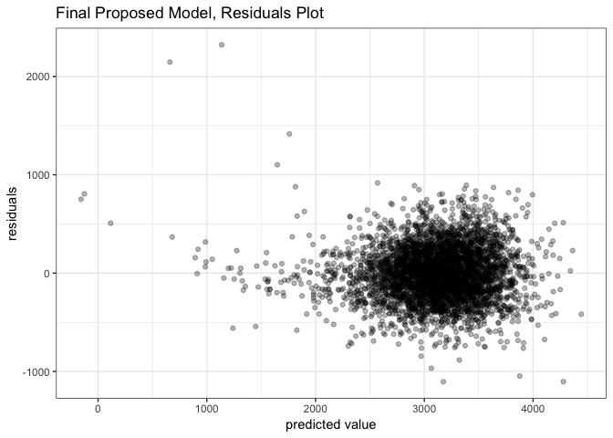

``` r

# histogram of residuals
bw_fit_final %>% 
  ggplot(aes(x = resid)) +
    geom_histogram()
```

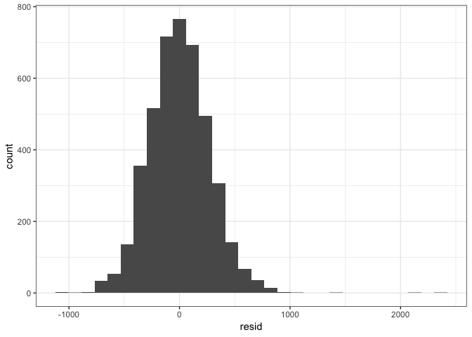

### Problem 2.2 - Cross-Validation

We will use cross-validation to compare the final proposed model (fit\_final) with a two predictor model (blength, gaweeks) and three-way interaction model (bhead, blength, babysex).

Iteration for RMSE will be performed over 100 cross-validation folds with an 80% training and 20% test split.

``` r
# two predictor model
fit_2 = lm(bwt ~ blength, gaweeks, data = bw)

# 3 way interaction model
fit_3 = lm(bwt ~ bhead * blength * babysex, data = bw)
```

``` r
cv_bw = modelr::crossv_mc(data = bw, n = 100, test = 0.2, id = "id")

cv_bw = cv_bw %>% 
  mutate(lm_final = map(train, ~lm(bwt ~ bhead + blength + delwt + gaweeks + mrace + smoken, data = .x)),
         lm_2pred = map(train, ~lm(bwt ~ blength, gaweeks, data = .x)),
         lm_3pred = map(train, ~lm(bwt ~ bhead * blength * babysex, data = .x))) %>% 
  mutate(rmse_final = map2_dbl(lm_final, test, ~rmse(model = .x, data = .y)),
         rmse_2pred = map2_dbl(lm_2pred, test, ~rmse(model = .x, data = .y)),
         rmse_3pred = map2_dbl(lm_3pred, test, ~rmse(model = .x, data = .y)))
```

The proposed model from our explanatory search has the lowest RMSE, in comparison to the 2 and 3 predictor model. We prefer the 6-predictor proposed model due to the strongest prediction accuracy.

``` r
cv_bw %>% 
  select(starts_with("rmse")) %>% 
  gather(key = model, value = rmse) %>% 
  mutate(
    model = str_replace(model, "rmse_", "model "),
    model = fct_reorder(model, rmse)) %>% 
  ggplot(aes(x = model, y = rmse)) + 
    geom_violin() +
  labs(title = "Distribution of RMSE from Cross-Validation", 
    x = "Model", 
    y = "RMSE")
```

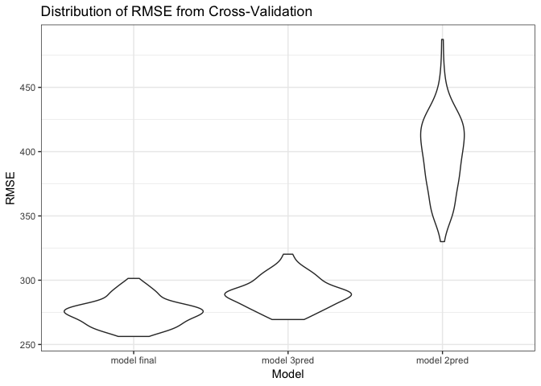
